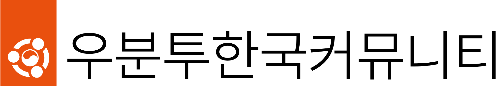
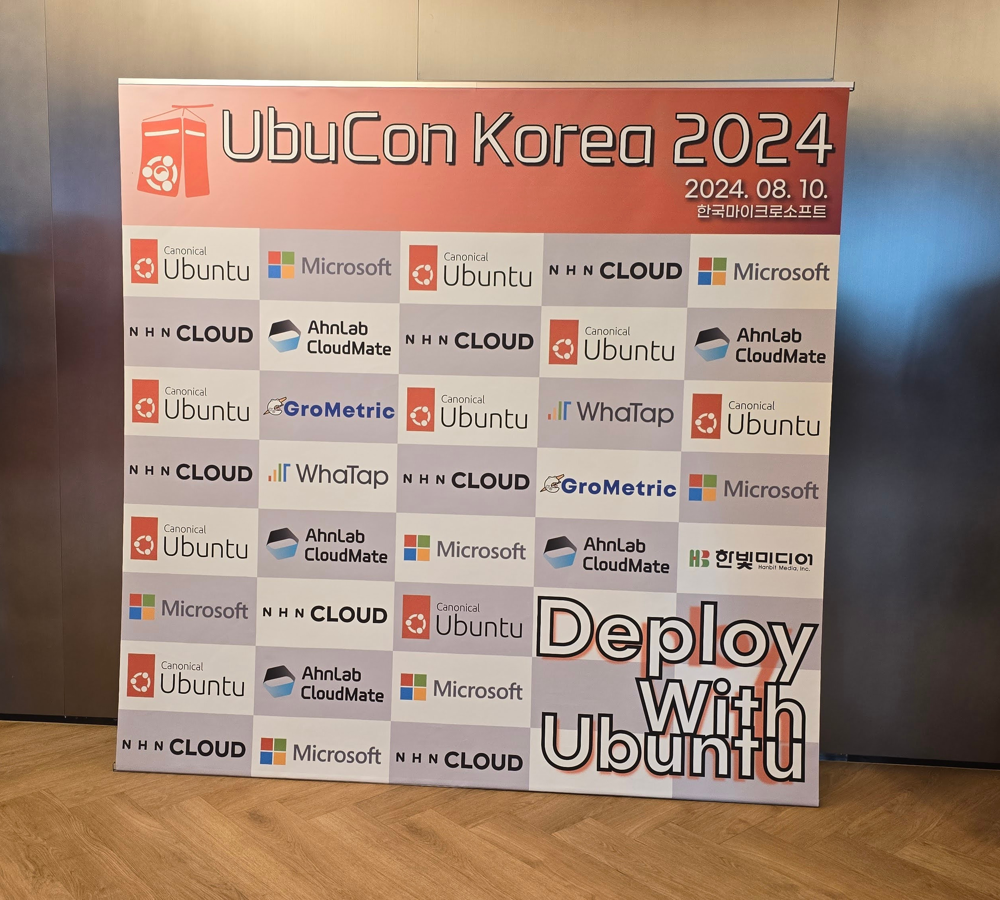
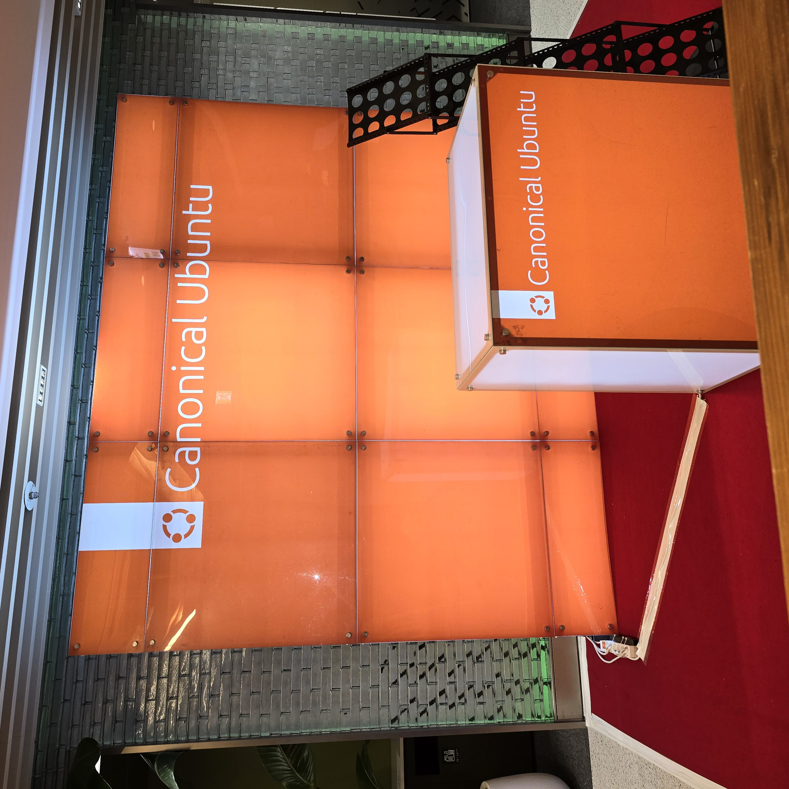
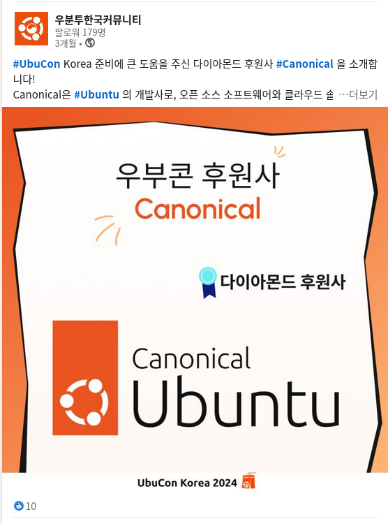
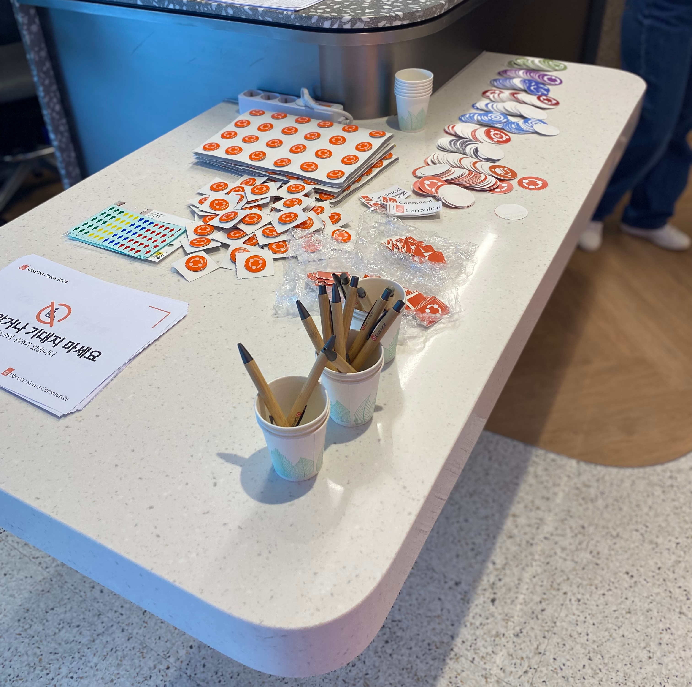

# UbuCon Korea 2025
2025년 8월 9일
한국마이크로소프트 (13F)
**후원 제안서**

<!-- _paginate: skip -->

---

<!-- header:  -->
<!-- footer: https://2025.ubuntu-kr.org | sponsorship@ubuntu-kr.org -->

# Ubuntu & UbuCon Korea 소개

캐노니컬(Canonical)과 전세계 사람들로 구성된 우분투 커뮤니티가 함께 개발한 **우분투(Ubuntu)** 는 오늘날 가장 널리 쓰이는 리눅스 기반 오픈소스 운영체제 입니다. 20년 전 사용하기 쉬운 리눅스 데스크톱으로 시작한 우분투는, 혁신을 가속화하고 운영을 뒷받침하는 동시에 더 많은 사람들에게 자유 소프트웨어(Free software)를 제공한다는 사명을 바탕으로, 오늘날 개인용 컴퓨터에서 클라우드 인프라에 이르기까지 수백만 개의 디바이스를 구동하며 AI, 클라우드 컴퓨팅, IoT 및 기업 솔루션의 기술 발전의 기반이 되고 있습니다.

오늘날 전 세계 우분투 커뮤니티의 사람들이 모여 우분투 생태계의 다양한 프로젝트와 사례를 공유하는 **두 가지 주요 연례 행사**로, **Ubuntu Summit**과 여러 지역에서 열리는 **UbuCon**이 있습니다.

두 행사의 가장 큰 차이점 이라면, Ubuntu Summit은 우분투를 개발한 캐노니컬에서 준비를 주도하는 반면, UbuCon은 커뮤니티가 **전적으로 준비하여 주최하는 커뮤니티 주도형 행사라는 점입니다.** 이러한 UbuCon은 대륙이나 국가 내에서 다양한 지역을 순회하면서 열리며, 오늘날 UbuCon NA @ SCaLE, UbuCon Europe, UbuCon Latin America, UbuCon Portugal, UbuCon Asia 행사가 매년 열리고 있습니다.  

**UbuCon Korea**는 한국 내 우분투 프로젝트 기여자와 사용자를 모으는 연중 가장 큰 국내 우분투 커뮤니티 행사로, 대면 행사로는 서울에서 처음 열렸던 UbuCon Asia 2022에 이은 스핀오프로 시작 되었습니다. “개발자 생산성을 위한 우분투(Ubuntu for Developer Productivity)” 를 테마로 프로그램 구성한 UbuCon Korea 2023은 작년 9월 9일 한국마이크로소프트에서 151명의 참석자와 함께 성공적으로 개최 되었습니다. 작년에 이어 올해는 8월 10일 작년과 동일한 장소에서 개최 할 예정이며, “우분투와 함께 배포하기(Deploy with Ubuntu)”를 테마로 다양한 프로그램이 구성 될 예정입니다!

## 행사 개요

- **행사명:** UbuCon Korea 2025
- **테마:** 우분투와 함께 배포하기 (Deploy with Ubuntu)
- **날짜:** 2025년 8월 9일
- **장소:** 한국마이크로소프트(더케이트윈타워 A동 13층)
- **규모:** 약 150명 이상 참가자 규모 (발표자 및 행사 관계자 포함)
- **주최:** 우분투한국커뮤니티
- **입장권**
  - 일반 참가자 (유료)
  - 개인 후원 티켓/비즈니스 티켓 (유료)

---

# 우분투한국커뮤니티 소개

## 커뮤니티 소개
2005년에 시작한 우분투한국커뮤니티는, 국내 우분투 사용자와 기여자를 위한 커뮤니티이며, Ubuntu Local Community Council 에서 인증한 공식 우분투 지역 커뮤니티 이기도 합니다. 국내 우분투 및 관련 오픈소스의 저변 확대를 위해, 우분투 관련 질의응답을 위한 포럼 운영, 각종 우분투 패키지의 한국어 번역, 한국어 위키 운영 및 문서 작업 등을 하고 있으며. 커뮤니티 구성원간 오프라인 교류를 위한 정기 총회, 정기 세미나, 워크샵 행사, 그룹 스터디 활동, UbuCon 등 다양한 오프라인 행사도 개최하고 있습니다.

## 우분투 저변 확대 및 사용성 개선을 위한 활동
커뮤니티의 시작 때 부터 함께해 온 포럼은 지금도 운영되고 있으며, 최근 Discourse 기반으로 개편되어 이용하기 더 편리해 졌습니다. 우분투에서 제공하는 다양한 패키지의 다국어 지원은 각 국가별 지역 커뮤니티의 기여로 관리되고 있습니다. 우리 커뮤니티 또한 번역팀을 운영하고 있으며, 이를 통해 우분투 한국어 지원에 지속적으로 기여하고 있습니다. 필요한 경우, 우분투 릴리즈 노트 등 많은 사람들이 관심 있을 만한 문서를 한국어로 번역하여, 영어에 익숙하지 않은 사람들도 우분투 관련 정보를 용이하게 접할 수 있도록 하고 있습니다.

## 다양한 오프라인 행사 개최
온라인 포럼 운영이나, 우분투 프로젝트 기여 등 온라인 기반 활동 뿐만 아니라. 커뮤니티 구성원이 만나 교류 할 수 있도록 주기적으로 오프라인 행사를 열고 있습니다. 이렇게 열리는 행사는 정기 총회(연말 회계 결산 후 3개월 이내), 정기 세미나, 실습 위주의 워크샵 행사, 그룹 스터디 활동 등이 있으며, 매년 큰 규모로 UbuCon 행사 또한 개최하여 다양한 분야의 우분투 사용자와 기여자를 위한 자리 또한 마련하고 있습니다.

## 해외 커뮤니티와의 교류
Ubuntu Japan, Ubuntu Taiwan, Ubuntu Malaysia, Ubuntu Indonesia, Debian Japan, FOSS Nepal, Ubuntu India, FOSSASIA 등 다양한 해외 우분투 및 오픈소스 커뮤니티와 지속적으로 교류하고 있으며, 아시아 지역 우분투 커뮤니티 교류의 장인, UbuCon Asia 에도 참여하여 각 커뮤니티별 활동에 대해 공유도 하고 있습니다.

  
  
  

---
# 행사장 및 시간표

  
  
  

## 행사장
**한국마이크로소프트(더케이트윈타워 A동 13층)**
행사가 열릴 장소인 한국마이크로소프트는, 광화문역 근처에 있는 더케이트윈타워 A동 13층에 위치해 있으며. 총 110명의 인원을 수용 가능한 회의실 및 등록 데스크, 참가자간 네트워킹 공간, 부스 운영, 케이터링도 가능한 라운지 공간도 구비되어 있습니다. 또한 회의실에는 자동 파티션이 있어, 키노트 진행시에는 모두 개방하여 하나의 회의실로 활용하고, 이후에는 파티션을 설치하여 강연과 워크샵 프로그램을 동시에 운영하는 등 유연하게 활용할 수 있습니다. 

## 시간표(초안)

| 제주 | 동해 | 독도 |
| --- | --- | --- |
| **10:00** 개회사 (30분) | | |
| **10:30** 기조연설 (30분) | | |
| **11:00** 강연 (30분) | **11:00** 워크샵 (90분) | **11:00** 강연 (30분) |
| **11:30** 강연 (20분 + 10분 휴식) | | **11:30** 강연 (20분 + 10분 휴식) |
| **11:00** 강연 (30분) | | **11:00** 강연 (30분) |
| **12:30** 점심식사 (60분) | | |
| **13:30** 강연 (30분) | **13:30** 워크샵 (90분) | **13:30** BoF (40분 +10분 휴식) |
| **14:00** 강연 (20분 + 10분 휴식) | | |
| **14:30** 강연 (30분) | | **14:20** BoF (40분) |
| **15:00** 오후 휴식 (20분) | | |
| **15:20** 강연 (30분) | **15:20** 워크샵 (90분) | **15:20** BoF (40분 + 10분 휴식) |
| **15:50** 강연 (20분 + 10분 휴식) | | |
| **16:20** 강연 (30분) | | **16:10** BoF (40분) |
| **16:50** 라이트닝 토크 (20분) | | |
| **17:10** 폐회사 (10분) | | |
---

# UbuCon Korea 참석자

  

  
<b>소프트웨어 엔지니어</b> 웹 (프론트엔드, 백엔드), 임베디드 & IoT, OS & 시스템 & 커널, 데스크톱 애플리케이션, 로보틱스

  
<b>교육 & 기타</b> 학생 (대부분 IT관련 전공), 교수, 연구원, 영업 담당자, 기업가(CEO등)

  

  

  
<b>IT 인프라 엔지니어</b> 클라우드 엔지니어, DevOps, SRE, 솔루션 아키텍트, 기술지원 엔지니어, 시스템 엔지니어

  
<b>데이터 & AI</b> 데이터 엔지니어, 데이터 과학자, AI/ML 엔지니어, 데이터 아날리스트

  
<b>커뮤니티 & 마케팅</b> 커뮤니티 매니저, DevRel, 마케팅 매니저

  

## 작년 행사 하이라이트

  
<b>173명</b> 사전 등록

  
<b>151명</b> 현장 참석

  
<b>18</b> 세션

  
<b>~76%</b> 처음 참석

  
<b>50%+</b> 경력 2년 이상

  
<b>60%+</b> IT관련 직무

<pre class="mermaid mermaid-100h">
%%{init: {'theme': 'base', 'themeVariables': { 'pieLegendTextSize': '11px', 'fontFamily': 'Ubuntu'}}}%%
pie showData
title Participants by profession (2024)
    "Software Engineer(Web Backend)" : 20
    "Software Engineer(Web Frontend)" : 8
    "Software Engineer(Embedded & IoT)" : 4
    "Software Engineer(OS, System & Kernel)" : 5
    "Software Engineer(Desktop Application)" : 7
    "Software Engineer(Robotics)" : 10
    "Cloud Engineer": 19
    "DevOps Engineer": 9 
    "SRE": 4
    "Support Engineer": 2
    "Solutions Architect": 3
    "AI/ML Engineer": 3
    "Researcher (Institute)": 2
    "Researcher (Enterprise)": 4
    "Students (IT majors)": 33
    "Students (Other majors)": 6
    "Teenagers": 5
    "Education": 4
    "Community Manager": 4
    "Marketing Manager": 7
    "Officials": 5
    "Enterprisers": 2
    "Etc": 7

</pre>

---
# 후원의 의미와 후원사 혜택
## 후원사로 참여하기
비영리 행사인 UbuCon Korea는, 자원봉사자로 구성된 준비위원회에서 금전적 보상 없이 준비하고 있어 행사 준비에 후원사의 지원과 개인 후원에 의존하고 있습니다.

저희는 이 행사를 통해, 우분투에 관심 있는 사람, 현업에서 활용하는 사람, 프로젝트에 기여하는 사람 등 다양한 사람을 한 자리에 모으고, 다른 오픈소스 커뮤니티와도 협력하여 네트워크를 강화하여 더 다양한 사람들과 소통하고자 합니다. 이를 달성하기 위해서는 충분한 자금 확보가 매우 중요합니다.

본 행사에 후원사로 참여 하는것은, 저희의 목표 달성을 도울 뿐만 아니라, 우분투 커뮤니티에 대한 진심 어린 지원을 보여주는 좋은 방법이라고도 할 수 있습니다. 또한, 저희가 제공하는 후원사 패키지를 통해, 청중을 대상으로 브랜딩을 강화하고, 회사나 서비스를 홍보하실 수 있으며, 참가자와 교류하여 잠재적으로 새로운 개발자나 엔지니어를 채용하는 데 활용하실 수 있습니다.

## 후원사로 참여해야 하는 이유

  

  

     
    <b>정해진 대상 청중</b> 
    대부분 IT업계에 종사하는 청중을 대상으로 타겟 마케팅을 집행하여 의미있는 리드를 늘릴 수 있는 좋은 기회입니다.
  

  

     
    <b>인재 영입</b> 
    업계에서 가장 뛰어난 인재를 채용하세요.
    작년 참석자 중 60% 이상이 IT 관련 직종에 종사했습니다.
  

  

     
    <b>브랜딩 강화</b> 
    후원사 로고가 현수막과 웹사이트 및 비디오에 노출됨은 물론, 매체를 통한 홍보에도 이름 등이 노출 됩니다.
  

  

  

  

     
    <b>제품 및 서비스 홍보</b> 
    잠재적 고객 및 기존 고객과 직접 대면하여 혁신적인 제품과 서비스를 소개하고 의미있는 피드백을 받을 수 있습니다.
  

  

     
    <b>사고 리더십 구축</b> 
    우분투와 우분투 생태계에 대한 후원사의 전문성을 확산하고, 후원사의의 제품, 서비스 및 오픈 소스 전략에 대해 커뮤니티에 전파하세요.
  

  

     
    <b>오픈소스와 커뮤니티 지원</b> 
    이 행사를 후원사는 것은 오픈소스와 커뮤니티에 대한 진심 어린 지원을 보여주는 가장 좋은 방법 중 하나라고 할 수 있습니다.
  

  

---

# 지난 후원사

  
  
  

  
  
  

  
  
  

  
  
  

  
  

지난 후원사 중 **절반 이상**은 이미 이 행사에 **2회 이상** 후원사로 참여해 왔습니다.

---

# 후원사 패키지

| **Package** | Diamond | Gold | Silver | Bronze | Supporter  |
| --- | --- | --- | --- | --- | --- |
| **수량** | 1 | 1 | 2 | 4 | ∞ |
| 금액(원)*0 | 6,000,000 | 3,000,000 | 1,600,000 | 800,000 | 500,000 |
| **로고 노출** |  |  |  |  |  |
| 기본 | O | O | O | O | O |
| 녹화 & 무대(연단) | O | O | X | X | X |
| 명찰 & 기념품 | O | O | X | X | X |
| **입장권**  | 5장 무료 | 4장 무료 | 3장 무료 | 2장 무료 | 5장 10% 할인 |
| **후원사 세션***1 | 기조연설 & 세션 1회*2 | 세션 1회*3 | 라이트닝 토크 (5분) | X | X |
| **후원사 부스** | 1.8m 너비 | 1.8m 너비 | 1.8m 너비*4 | X | X |
| **마케팅** |  |  |  |  |  |
| 기본 | O | O | O | O | O |
| 이메일 | 이름+링크+로고 | 이름+링크+로고 | 이름+링크 | 이름+링크 | 이름만 언급 |
| 상호작용 | O | O | O | O | X |
| **증정품 지급** | O | O | O | O | O |

**주석**
- *0: 부가세 10%는 별도 입니다.
- *1: 후원사 세션 또한 예외 없이 행동강령 준수와 콘텐츠 팀 검토가 필요하며, 우분투나 관련 오픈소스 기술과 관련된 내용이여야 합니다. 또한, 노골적인 마케팅 및 매출 증대 목적의 내용은 금지됩니다.
- *2: 워크샵 1회, 강연 1회 또는 BoF 1회 중 선택
- *3: 강연 1회 또는 BoF 1회 중 선택
- *4: 별도 구매 상품으로, 수량은 1개, 선착순 주문 마감입니다. 가격은 200,000원 입니다. (부가세 별도)

---
# 후원사 패키지 세부사항

## 로고 노출
- **기본:** 후원사의 로고가 웹사이트, 행사장 라운지의 대형 현수막과 각 세션별 녹화 영상 인트로에 노출됩니다.
- **녹화 & 무대(연단):** 강연 녹화 영상에서, 배너 영역에 후원사 로고가 노출되며. 회의실 연단 옆에 설치되는 현수막에도 후원사 로고가 노출됩니다.
- **명찰 & 기념품:** 모든 참가자가 지급받는 명찰과 티셔츠 등 기념품에 후원사 로고가 노출됩니다. 명찰은 행사 중 참가자가 항시 착용하므로, 로고를 가장 자주 노출하는 효과적인 방법이며, 티셔츠 등 기념품을 통해 행사 이후에도 로고 노출이 가능합니다.

  
  
  

## 입장권 지원
감사한 마음을 담아, 후원사 등급에 따라 무료 혹은 할인 입장권을 지원 해 드립니다. 지원 받은 티켓으로 행사에 참여하여, 참가자와 쉽게 교류하실 수 있습니다.

## 후원사 세션
- 후원사의 우분투 및 관련 오픈소스 기술에 대한 경험이나 사례, 팀에서 일하는 문화 등을 소개 하기에 좋은 기회 입니다.
- 세션 내용은 우분투나 관련 오픈소스 기술과 관련된 내용이여야 하며, 행동강령을 준수해야 합니다. UbuCon은 제품을 판매하는 자리가 아니므로 제품을 과도하게 홍보하는 행위 또한 금지됩니다.
- 후원사 세션은 웹사이트 및 다른 매체에서 후원사 세션으로 표시됩니다.

## 후원사 부스
행사장에 마련된 후원사 부스를 통해, 후원사를 알리고 참가자와 직접 소통하실 수 있습니다. 부스 이벤트나 미니 세션 등의 활동도 가능하며, 이를 통해 회사나 단체의 제품과 서비스 활동 등을 홍보하실 수 있습니다.

---
# 후원사 패키지 세부사항

## 마케팅
**기본:** 행사 전/후로 커뮤니티의 다양한 홍보 채널과 참가자 대상 채널을 통해 후원사 홍보 해 드립니다.
- 개회사 및 폐회사 진행 시 후원사 언급 및 로고 노출
- 커뮤니티의 소셜 미디어 채널을 통해 후원사 소개 및 감사 인사 게시
- 웹사이트에 별도의 후원사 소개 페이지 제공 

**이메일:** 행사 시작 1-3일 전 참가자 대상으로 발송되는 리마인더 메일에, 후원사에 대한 간략한 소개 또는 언급이 포함되어 발송됩니다. 후원사 등급에 따라 메일 본문에 노출되는 형태가 상이합니다.

**상호작용:** 행사 종료 이후에도 후원사가 참가자와 상호작용 할 수 있도록 도와 드립니다. 후원사 등록시 별도 요청이 없는 경우, 후원사 측에서 요청한 텍스트를 전달받아 참가자를 대상으로 이메일을 1회 발송 해 드릴 수 있습니다.
- 후원사 등록 시 희망 하시는 경우, 이메일 발송 대신 개인정보 제3자 제공 동의를 한 참가자의 목록을 전달 받으실 수 있습니다.
  - 제공되는 항목은 참가자의 성함, 소속, 직책(또는 직업), 이메일 주소이며. 준비위원회 측에서 웹사이트를 통해 공개하는 개인정보 처리방침 기재할 정보(개인정보를 제공받는 자, 위치(주소), 담당자 및 연락처, 이용목적, 보유기간 만료 시 파기방법) 등을 반드시 알려 주셔야 합니다.
  - 전달 받으신 개인정보의 보유 기간은 2026년 8월 9일 까지(1년)로 주최측의 개인정보 처리방침에 따라 기재됩니다.

## 증정품 지급
희망하시는 경우, 참가자를 대상으로 후원사의 증정품(스티커, 티셔츠, 에코백, 머그컵등의 굿즈)를 지급하실 수 있습니다. 추첨용으로 소량만 전달도 가능하고, 참가자 전원 지급 가능한 수량을 전달 해 주실수도 있습니다. 전달 방법에 대해서는 별도로 안내 해 드립니다.

  
  

---
# 후원사 등록 절차 안내

## 후원 패키지 선택 및 협의
위에 나온 후원사 패키지 중, 희망하시는 패키지를 선택하신 후, 후원사 등록 신청 양식을 제출 해 주세요. 확인 후, 수량이 남아 있다면 후원사 등록 절차를 진행 해 드립니다. 패키지 세부사항을 조정하고 싶으시거나, 행사 운영에 필요한 기념품이나 장비 또는 서비스 등의 현물 후원을 원하시는 경우 준비위원회 측과 협의를 통해 후원도 가능합니다. 현물 후원의 경우, 현금으로 환산했을 때 가치에 따라 혜택을 제공 해 드립니다. 

## 후원사 등록 서류 발행
- 견적서 - 후원사 내부 품의 절차에 필요하신 경우, 요청하시면 발행 해 드립니다.
- 계약서 - 후원사측 필요에 따라 행사 후원 계약서를 작성합니다. 후원사 측에서 필요하지 않은 경우 생략 가능합니다.
- 세금계산서(혹은 인보이스) - 계약서 작성 완료 후, 계약서가 생략된 경우 후원사 내부 품의 절차 완료 후 “우분투한국커뮤니티” 명의로 세금계산서를 발행 해 드립니다. 해외법인인 경우, 대행사를 통해 인보이스가 대신 발행됩니다.

## 후원 비용 결제
세금계산서(혹은 인보이스) 발급 완료 후, 안내드린 계좌로 부가세 10%를 포함한 후원 비용을 입금 해 주시면, 확인 후 후원사 등록 완료 처리 됩니다. 입금 기한은 계약서를 작성 한 경우, 계약서에 명시된 사항을 따르며. 계약서가 생략 된 경우, 세금계산서 발행일로부터 2주 이내 입금 해 주시면 됩니다. 기한 연장이 필요한 경우, 협의를 통해 연장 가능하며. 늦어도 행사 시작 3주 전 까지는 입금이 완료 되어야 합니다.

## 후원사 등록 완료
후원사 등록이 완료 되면, 웹사이트에 로고가 게재 되며 후원사 세션 등 혜택 사용에 대해 안내 드립니다. 후원 해 주신 금액은 행사장 시설물 주문 및 설치 비용, 케이터링 비용, 명찰과 스티커 및 티셔츠 등 기념품 제작 비용, 관계자 식비, 발표자/자원봉사자/준비위원 중 지방 거주 인원을 위한 교통비, 지방 거주 참가자 중 경비 지원 프로그램에 지원하여 선택된 인원의 교통비, 영상 스트리밍 및 녹화장비 대여 등의 행사 운영 비용으로 사용됩니다. 사용 후 남은 비용은 세무대리인 수수료 등 커뮤니티 관리 비용으로 활용됩니다.

## 우분투 행동 강령 (Ubuntu Code of Conduct) 준수 안내
우분투한국커뮤니티에서 주최하는 모든 행사에서는, 참가자 모두가 존중받는 안전한 환경을 조성하기 위하여, 모든 참가자 분들께 “우분투 행동 강령 (Ubuntu Code of Conduct)” 를 따르도록 안내 드리고 있습니다. 이는 후원사에도 예외 없이 적용 됩니다. 행동강령 본문(영문)을 읽어 보시고, 준수 해 주시기 바랍니다. 
https://ubuntu.com/community/ethos/code-of-conduct 

---

# End of Document

행사 후원을 검토 해 주셔서 감사합니다.
후원 패키지 확보 및 관련 문의가 있으신 경우
아래 이메일 주소로 후원사 팀에 연락해 주세요.
sponsorship@ubuntu-kr.org 

행사에 대한 자세한 정보는 웹사이트에서 확인 가능합니다.
https://2025.ubuntu-kr.org

<!-- _paginate: skip -->
<!-- footer: false -->