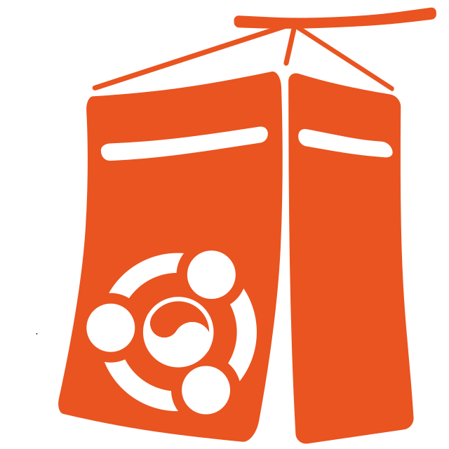
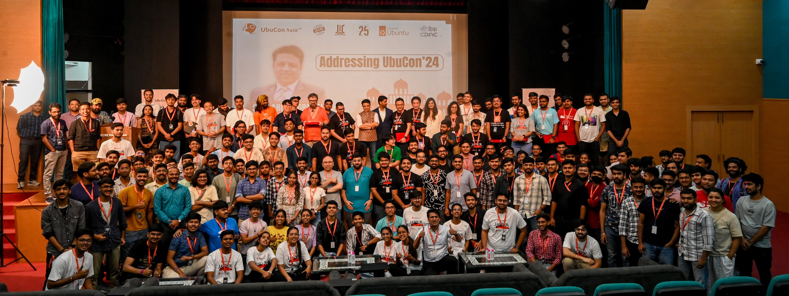
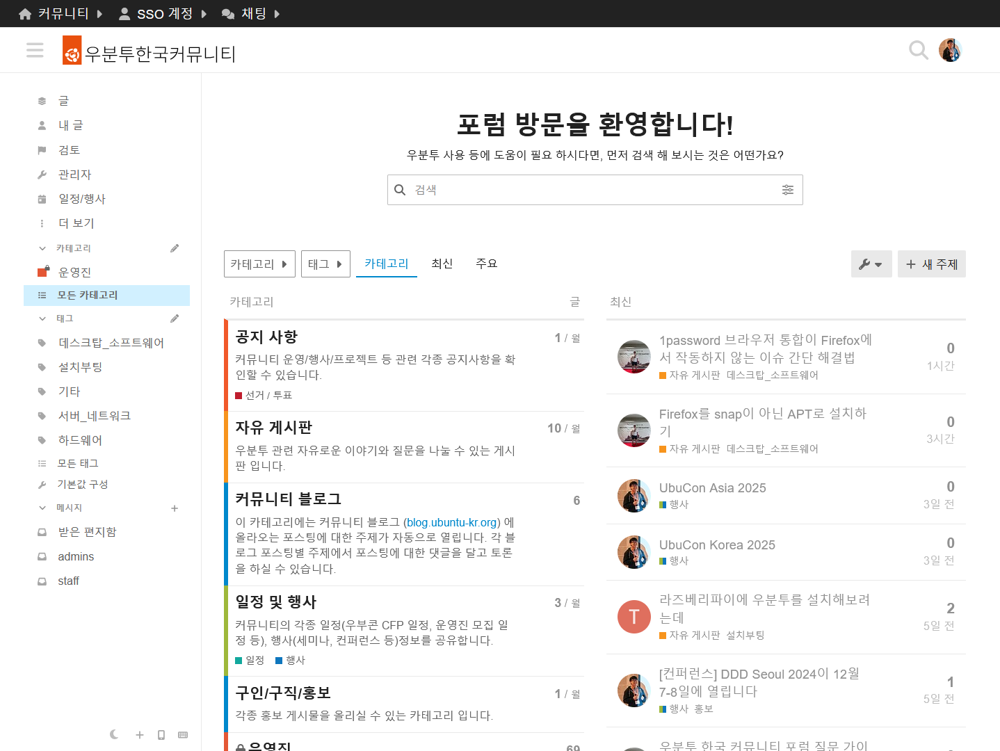
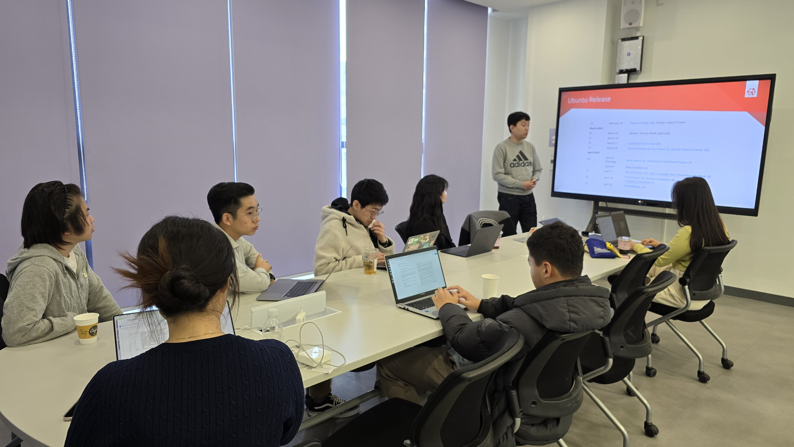
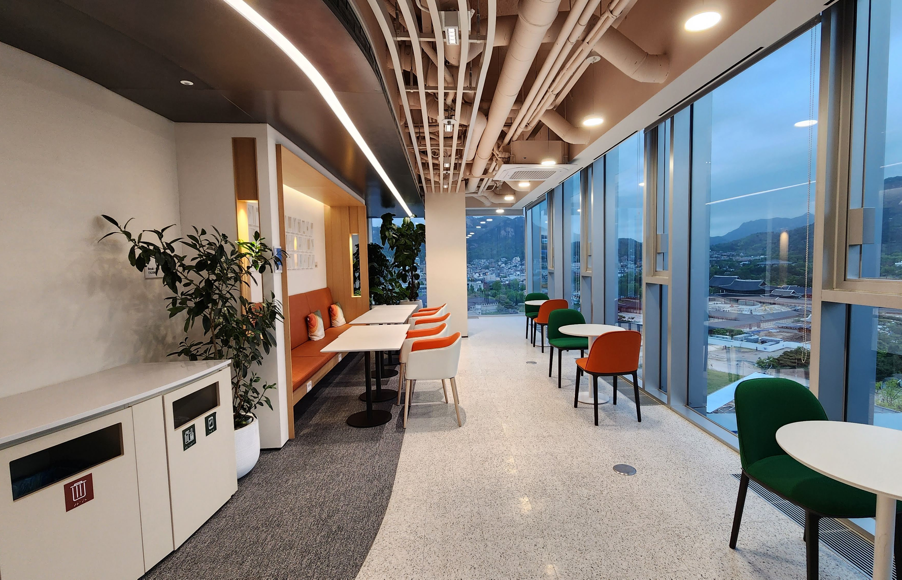
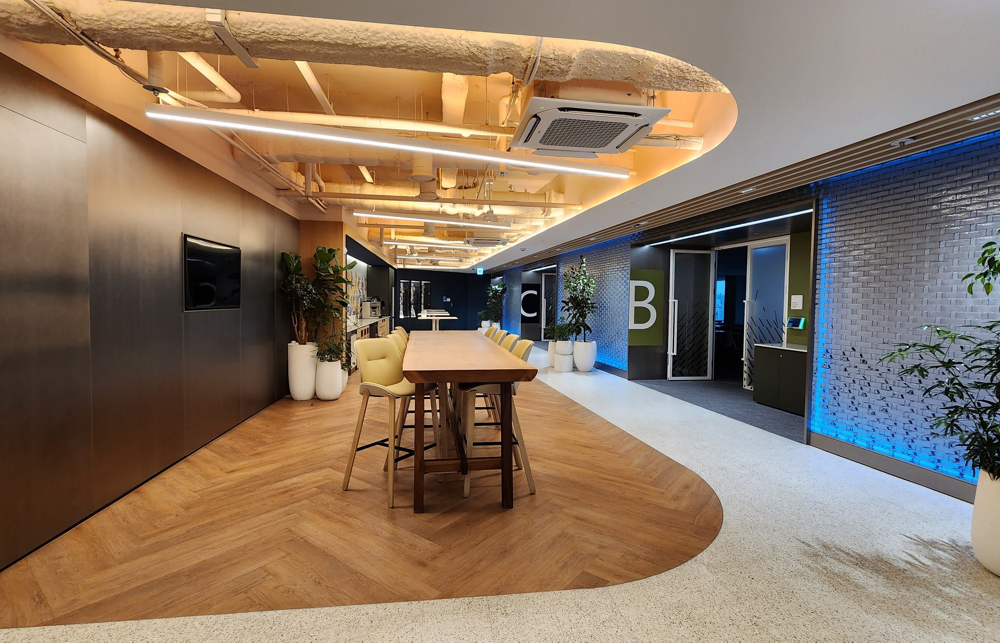
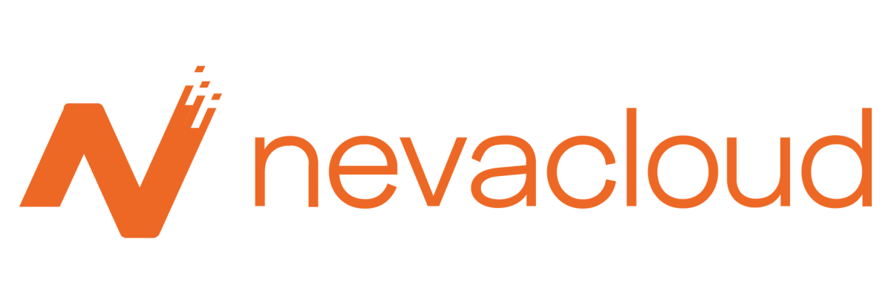
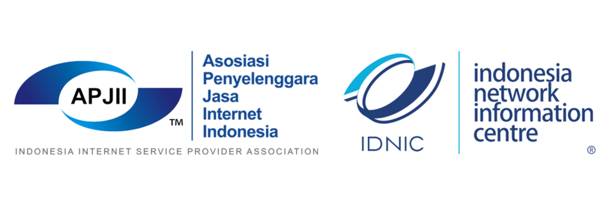
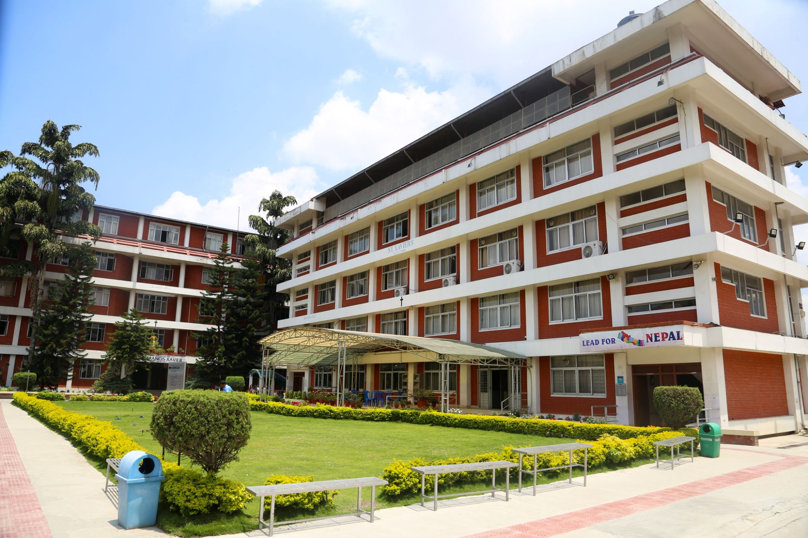

# UbuCon Korea 2025
August 9
Microsoft Korea (13F)
Seoul, South Korea
**Sponsorship prospectus**

<!-- _paginate: skip -->

---

<!-- header:  -->
<!-- footer: https://2025.ubuntu-kr.org | sponsorship@ubuntu-kr.org -->

# About UbuCon(s) & Ubuntu Summit

Today, there are two major annual events for Ubuntu, the most popular Linux distribution for desktops and servers, the IoT, cloud, AI/ML, and more, and for the Ubuntu community, which includes contributors and users of various Ubuntu projects around the world.

The Ubuntu Summit, an annual event that brings together people from the global Ubuntu community to share various projects and practices in the Ubuntu ecosystem. The Ubuntu Conference (UbuCon), an annual event that focuses more on local Ubuntu communities and sharing Ubuntu practices and know-how from local community.

The main difference between the two events is that Canonical, the creator of Ubuntu, is largely involved with organizing the Ubuntu Summit, while UbuCon is a community-driven event that is almost entirely organized by the community. These UbuCons are held in different regions within a continent or country, and today there are UbuCon @ SCALE, UbuCon Europe, UbuCon Latin America, and UbuCon Asia.  

UbuCon Korea is the largest domestic Ubuntu community event of the year, bringing together contributors and users of Ubuntu projects in Korea, and was started as a spin-off of UbuCon Asia 2022, which was the first in-person event in Seoul. UbuCon Korea 2023 was successfully held last year on September 9 at Microsoft Korea with 151 attendees, with the theme of "Ubuntu for Developer Productivity". Following the success of last year's event, UbuCon Korea 2023 will be held on August 10 at the same venue as last year's event, with a variety of programs organized around the theme of "Deploy with Ubuntu"!

## Event overview

- **Name:** UbuCon Korea 2025
- **Theme:** Deploy with Ubuntu
- **Date:** August 9th, 2025 
- **Venue:** Microsoft Korea (The K Twin Tower - Building A 13F)
- **Scale:** 150+ participants (Including speakers and staff)
- **Host:** Ubuntu Korea Community
- **Tickets**
  - Standard (Paid)
  - Individual patron/business (Paid)

---

# About Ubuntu Korea Community

## About the community
Started in 2005, the Ubuntu Korea Community is a place for Korean Ubuntu users and contributors, and is also an official Ubuntu local community verified by the Ubuntu Local Community Council. To expand the popularity of Ubuntu and related open sources in Korea, the community operates forums for Ubuntu-related Q&A, translates various Ubuntu packages into Korean, runs a Korean Ubuntu wiki, and works on documentation. We also hold various offline events such as general meetings, regular seminars, workshops, group study activities, and UbuCon for offline exchanges among community members.

## Activities to expand Ubuntu adoption and improve usability
Our online forum, which has been with the community since its beginning, is still live and has recently been revamped with Discourse to make it more user-friendly. Multilingual support for the various packages available in Ubuntu is maintained by local communities in each country. Our community also has a translation team, which continues to contribute to Korean support for Ubuntu. When necessary, we translate documents of interest to many people, such as Ubuntu release notes, into Korean, making it easier for people who are not familiar with English to access information about Ubuntu.

## Host a variety of in-person events
In addition to online-based activities such as running online forums and contributing to Ubuntu projects. We periodically organize offline events for community members to meet and interact. These events include regular general meetings (within three months after closing finances each year), regular seminars, hands-on workshop events, group study activities, and the annual UbuCon, a large-scale event that brings together Ubuntu users and contributors from various fields.

## Engaging with international communities
We continue to interact with various overseas Ubuntu and open source communities, including Ubuntu Japan, Ubuntu Taiwan, Ubuntu Malaysia, Ubuntu Indonesia, Debian Japan, FOSS Nepal, Ubuntu India and FOSSASIA, and we also participate in UbuCon Asia, the premier event for Ubuntu community exchange in Asia, where we share our activities with each community.

  
  
  

---
# The venue & Proposed timetable

  
  
  

## The venue
**Microsoft Korea (The K Twin Tower - Building A 13F)**

Microsoft Korea is located on the 13th floor of Building A of The K Twin Tower, near Gwanghwamun Station. It has a conference room with a total capacity of 110 people, a registration desk, and a lounge area that can be used for networking, booths, and catering. The conference room has automatic partitions, so it can be used as a single room for the keynote, and then partitioned off to run the talks and workshop programs simultaneously.

## Proposed timetable

| Jeju Hall | Donghae Hall | Dokdo Hall |
| --- | --- | --- |
| **10:00** Opening (30min) | | |
| **10:30** Keynote (30min) | | |
| **11:00** Talk (30min) | **11:00** Workshop (90min) | **11:00** Talk (30min) |
| **11:30** Talk (20min + 10min break) | | **11:30** Talk (20min + 10min break) |
| **11:00** Talk (30min) | | **11:00** Talk (30min) |
| **12:30** Lunch break (60min) | | |
| **13:30** Talk (30min) | **13:30** Workshop (90min) | **13:30** BoF (40min +10min break) |
| **14:00** Talk (20min + 10min break) | | |
| **14:30** Talk (30min) | | **14:20** BoF (40min) |
| **15:00** Afternoon break (20min) | | |
| **15:20** Talk (30min) | **15:20** Workshop (90min) | **15:20** BoF (40min + 10min break) |
| **15:50** Talk (20min + 10min break) | | |
| **16:20** Talk (30min) | | **16:10** BoF (40min) |
| **16:50** Lightning talks (20min) | | |
| **17:10** Closing (10min) | | |
---

# Who attends UbuCon Asia

  

  
<b>Software Engineers</b> System, Application (Web, Desktop, etc), Embedded (IoT, Robotics, etc), Kernel & Operating Systems

  
<b>Academic & Other</b> Students (IT related majors), Professors, Researchers, Analysts, Media, Marketing, Enterprisers

  

  

  
<b>IT Infra & Operations</b> SRE, SysAdmins, Solution Architects, DevOps, Cloud

  
<b>Data & AI</b> Data Engineers, Data Scientists, DBA, AI/ML Engineers

  
<b>Community & Leadership</b> Community Managers, DevRel, Technical Managers, OSPO Teams

  

## Highlights from last year

  
<b>Total ~300</b> Participants

  
Participants from  <b>9 countries</b>

  
Session proposals <b>54 received</b>

  
<b>30 Speakers</b> in total

<pre class="mermaid mermaid-100h">
pie showData
title Participants by profession (2024)
    "Students" : 50
    "Web Developer" : 60
    "DevOps Engineer" : 30
    "IoT Engineer" : 30

</pre>

---
# Become a sponsor!

---

# Past sponsors

  
  
  

  
  
  

  
  
  

  
  
  

---

# Sponsorship packages

| **Package** | Diamond | Gold | Silver | Bronze | Supporter  |
| --- | --- | --- | --- | --- | --- |
| **Slots** | 1 | 2 | 6 | ∞ | ∞ |
| Price(USD) | 10,000  | 6,000 | 3,500 | 1,600 | 500 - 800 |
| Price(NPR)*0 | TBD  | TBD | TBD | TBD | TBD |
| **Logo exposures** || |
| Website | XL | L | M | S | S |
| Plenary banner*1 | XL | L | M | S | XS |
| Stage (or Podium) banner | Yes | Yes | Yes | No | No |
| Nametag | Yes | Yes | No | No | No |
| Video banner*2 | Yes | Yes | No | No | No |
| Video sponsor information scene*3 | Yes | Yes | Yes | Yes | Yes |
| T-Shirt (or other swag if no T-shirt) | Yes | Yes | No | No | No |
| **Recognition** || |
| Recognition posting on social media | Yes | Yes | Yes | Yes | Yes |
| Recognition posting on blog | Yes | Yes | No | No | No |
| Mention during opening and closing session | Yes | Yes | Yes | Yes | Yes |
| **Engagements** || |
| Sponsored session*4 | A Keynote<small>(30min)</small>  + A Workshop<small>(90min)</small>,  A Talk<small>(30min)</small>  or A BoF<small>(40-50min)</small> | A Talk<small>(30min)</small> or A Workshop<small>(90min)</small> | A Talk<small>(30min)</small> | A Lightning talk(5min) <small>(Limited FCFS)</small> | No |
| Sponsor booth | L | M | S*5 | S*5 <small>(500 USD Add-on FCFS)</small> | No |
| Promotion video during breaks | 3min | 2min | 1min | No | No |
| Distribute Promotional Material  | Handout on attendee check-in + At booth | Handout on attendee check-in + At booth | At booth | At booth <small>(If booth allocated)</small> | No |
| Promotional Email to all Attendees*5 | Yes (One-time with custom content) | Yes (One-time with custom content) | Yes (One-time with custom content) | No | No |

Refer to next page for footnotes and additional sponsorship oppertunities.

---
# Sponsorship packages
## Footnotes

- *0: Price in Nepalese Rupees (NPR) is for business with primary office in Nepal.
- *1: A large size banner installed in reception area usually or enterance of the venue that number of attendees can take photo with banner as backdrop.
- *2: Banner of both live streams and video recordings if sessions will be streams or just on video recordings if not.
- *3: Duration of Scene will be around a few seconds in the video or live streams. 
- *4: Sponsored sessions are also subject to approval by the UbuCon Asia content team. Sponsors are required to share the Abstract alongside or before availing sponsorship for review. Note that session should be Ubuntu or relevant Open Source topics and need to comply with our Code of Conducts. Also, Sales or marketing pitches are not allowed.
- *5: Depending on logistics availability, this could be Booth with Size M but with located in less accessible area.
- *6: If sponsor desires, this could be replaced with "List of participants data with names, affiliation, job profession and email address". Only data from attendees opt-in to provide their data to sponsors during registration will be provided to sponsors. Attendees will be also informed about data provision to sponsors through registration form and also privacy policy if available.

## Additional sponsorship oppertunities

You may also become our in-kind sponsor by sponsoring coffee break, lunch, conference dinner, day trip, diversity initiatives and more! We’ll work with you to put together the right UbuCon Asia package for your company or organization. These additional opportunities may be sponsored separately or added on to a sponsorship package.

If there are no sponsorship packages that fits your budget and needs, We're also open to discuss adjust existing package or designing package tailored for you.

Please contact us at [sponsorship@ubucon.asia](mailto:sponsorship@ubucon.asia) to discuss such oppertunities! 

---

# End of Document

Thank you for consider sponsoring our event.
For inquires and securing sponsorship,
Contact sponsorship team at sponsorship@ubucon.asia 

More details on this event can be found at
https://2025.ubucon.asia

<!-- _paginate: skip -->
<!-- footer: false -->